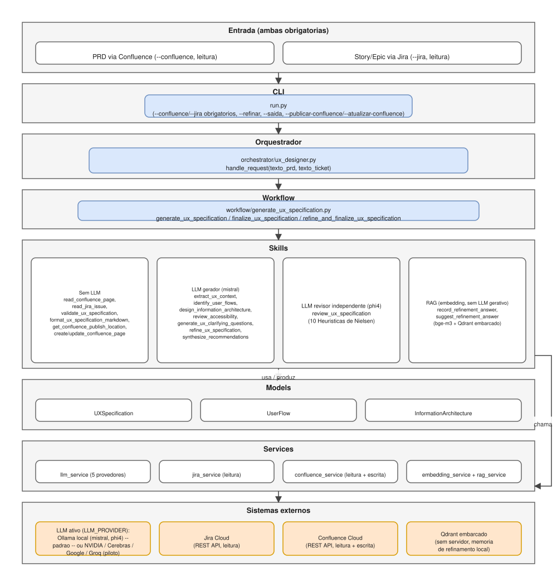
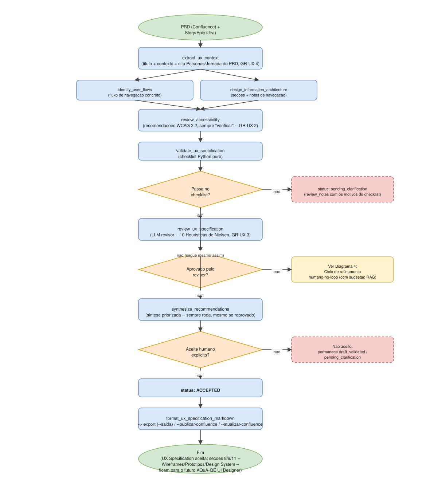
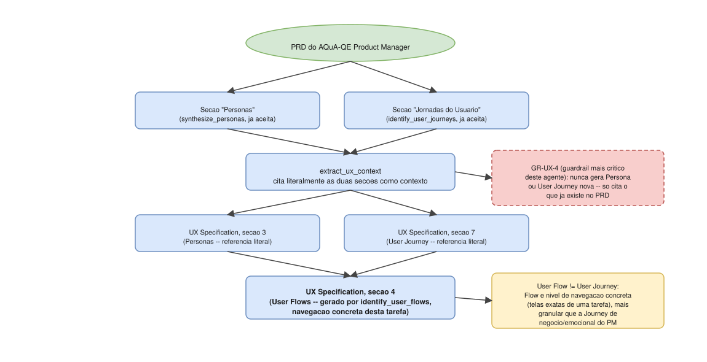
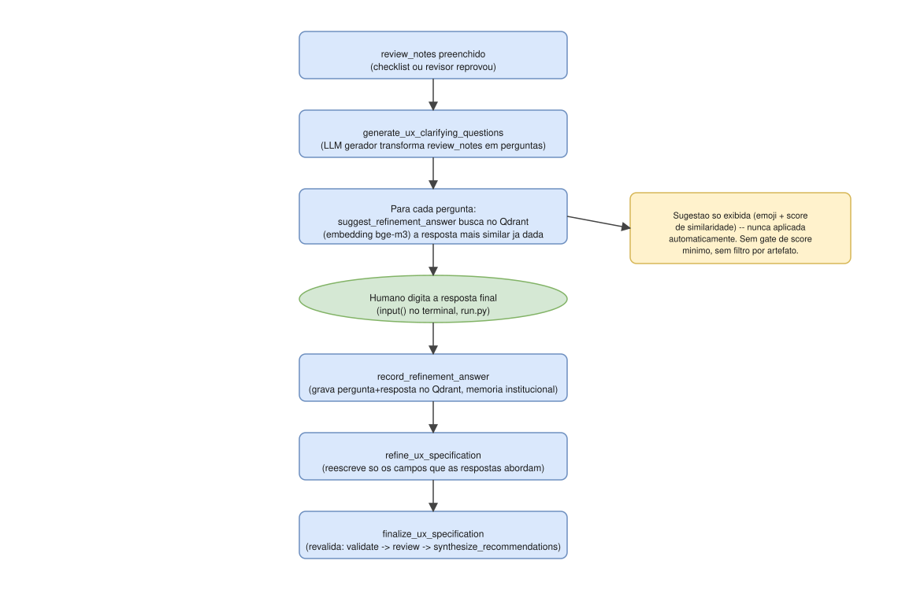
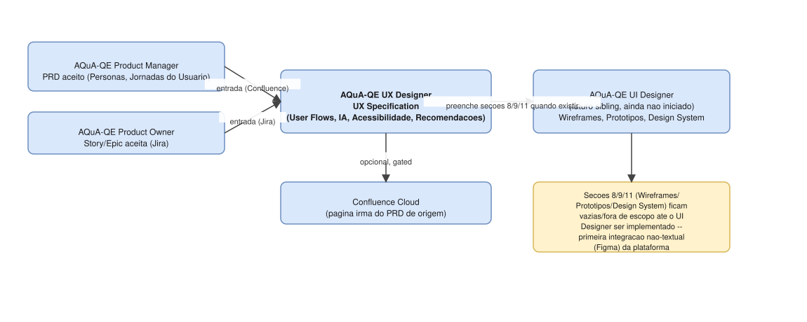

# Diagramas de arquitetura

Representação visual da arquitetura e dos fluxos do agente, complementando a documentação em prosa de `../agent/system_design.md`, `../agent/agent_design.md`, `../agent/skills.md` e `../../WHITEPAPER.md`.

- **Fonte editável**: [`architecture.drawio`](architecture.drawio) — arquivo único, 5 páginas, abra em [app.diagrams.net](https://app.diagrams.net) ou na extensão "Draw.io Integration" do VS Code.
- **Espelho estático**: `svg/*.svg` — mesmo conteúdo de cada página, visível diretamente aqui no GitHub/VS Code, sem precisar abrir o draw.io. Gerados por um conversor Python próprio (`.drawio` → SVG, interpretando containers/formas/arestas do mxGraph), não por exportação oficial do app draw.io — em caso de dúvida sobre fidelidade visual, o `.drawio` é a fonte de verdade; abra-o diretamente para conferir.

## 1 — Arquitetura em camadas

Da entrada — PRD via Confluence e Story/Epic via Jira, **ambas sempre obrigatórias** (diferente de PM/PO/SA, que aceitam múltiplas fontes alternativas) — até o provedor de LLM ativo (Ollama local por padrão; piloto opcional de NVIDIA/Cerebras/Google/Groq via `LLM_PROVIDER`, ver `../agent/system_design.md`), Jira/Confluence Cloud (leitura, e escrita gated no Confluence) e o Qdrant embarcado da memória de refinamento — passando por CLI, orquestrador, workflow, skills, models e services. As skills têm uma quarta banda além de "sem LLM"/"LLM gerador"/"LLM revisor": **RAG** (`record_refinement_answer`/`suggest_refinement_answer`), que usa embedding (`bge-m3`) mas nenhum LLM gerativo.

## 2 — Fluxo da UX Specification

`extract_ux_context` (que já cita Personas/Jornada do PRD, GR-UX-4 — ver Diagrama 3) alimenta `identify_user_flows` e `design_information_architecture` em paralelo, que por sua vez alimentam `review_accessibility` (recomendações WCAG 2.2, sempre "a verificar", nunca uma certificação de conformidade — GR-UX-2). Daí em diante, o mesmo pipeline `Validate → Review → [Refine] → Approve` de PM/PO/SA, com uma particularidade: `synthesize_recommendations` roda **sempre**, mesmo quando o checklist ou o revisor reprovam — a síntese da seção 12 precisa refletir o estado mais atual das recomendações de acessibilidade e observações de usabilidade, não só o caminho feliz. `review_ux_specification` é sempre avaliação heurística de especialista (10 Heurísticas de Nielsen), nunca um teste com usuário real (GR-UX-3). Detalhe textual em `../agent/system_design.md` e `../agent/acceptance_patterns.md`.

## 3 — GR-UX-4: Personas e User Journey nunca são geradas aqui

O guardrail mais crítico deste agente. As seções "Personas" e "Jornadas do Usuário" já existem no PRD aceito do AQuA-QE Product Manager (`synthesize_personas`/`identify_user_journeys`) — `extract_ux_context` só as lê e cita literalmente como contexto (seções 3 e 7 da UX Specification), nunca as regenera. Se o PRD não tiver a seção correspondente, isso vira uma lacuna sinalizada, nunca preenchida por este agente. Distinção importante: o **User Flow** da seção 4 (gerado por `identify_user_flows`) é nível de navegação concreta — telas exatas de uma tarefa —, mais granular e uma coisa diferente da **User Journey** de nível de negócio/emocional do Product Manager; não é uma duplicata, ver `../agent/agent_design.md`.

## 4 — Ciclo de refinamento humano-no-loop com memória RAG

Mesmo padrão de PM/PO/SA (perguntas objetivas via `generate_ux_clarifying_questions`, nunca autocorreção), com uma camada adicional herdada de PM/PO (issue [#3](https://github.com/dufelizardo/AQuA-QE-UX-Designer/issues/3)): antes de cada pergunta, `suggest_refinement_answer` busca no Qdrant embarcado (embedding `bge-m3`, collection `refinement_answer_memory`) a resposta mais similar já dada pelo humano em qualquer ciclo anterior (mesmo ou outro artefato/projeto) e a exibe como sugestão — **nunca aplicada automaticamente**, o humano sempre digita a resposta final. Cada resposta nova é gravada de volta (`record_refinement_answer`), alimentando a memória institucional. Sem gate de score mínimo nem filtro por tipo de artefato nesta fase. Ver `../agent/memory.md`.

## 5 — Pipeline completo e handoff (Product Manager + Product Owner → UX Designer → UI Designer)

Este agente consome o PRD aceito do AQuA-QE Product Manager (via Confluence) **e** a Story/Epic aceita do AQuA-QE Product Owner (via Jira) — as duas entradas obrigatórias — e produz a UX Specification. As seções 8/9/11 (Wireframes, Protótipos, Design System) existem na estrutura do documento, mas ficam deliberadamente vazias/fora de escopo nesta fase: serão preenchidas pelo futuro agente irmão AQuA-QE UI Designer (ainda não iniciado), que exigirá a primeira integração não-textual da plataforma (Figma). A ponte entre os agentes é sempre só o artefato exportado (arquivo `.md` ou página Confluence) — nenhuma chamada direta entre eles. Ver `../../WHITEPAPER.md`, seção 11.
